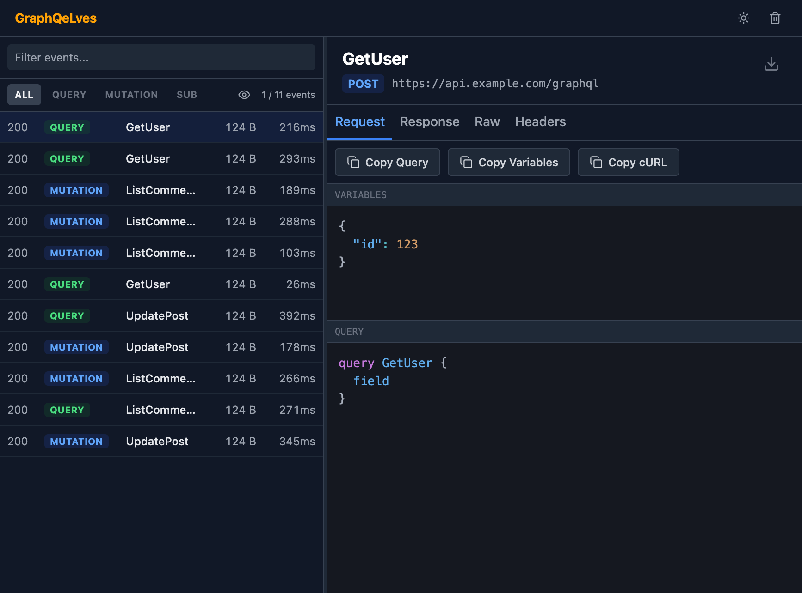

# GraphQeLves

A Chrome DevTools extension for inspecting and debugging GraphQL network requests.

<br>
<br>


<!-- TODO: Uncomment when published to Chrome Web Store
[](https://chrome.google.com/webstore/detail/graphqelves/YOUR_EXTENSION_ID)
-->



## Installation

### Chrome Web Store (Recommended)

<!-- TODO: Update with actual Chrome Web Store link when published
Install directly from the [Chrome Web Store](https://chrome.google.com/webstore/detail/graphqelves/YOUR_EXTENSION_ID).
-->

*Coming soon to the Chrome Web Store!*

### From Source

See [Development Installation](#development-installation) below.

## Features

- **Real-time monitoring** — Captures GraphQL queries, mutations, and subscriptions as they happen
- **Request inspection** — View operation names, variables, and full query text
- **Response analysis** — Browse formatted JSON responses with syntax highlighting
- **Network metrics** — Duration, response size, HTTP status codes
- **Filtering & search** — Filter by operation type, search by name or URL
- **Multi-select export** — Batch export selected requests as JSON with cURL commands
- **Header inspection** — View request/response headers (sensitive values auto-redacted)
- **Persisted query detection** — Identifies requests using Apollo-style persisted queries

## Usage

1. Open Chrome DevTools (`Ctrl+Shift+I` / `Cmd+Opt+I`)
2. Navigate to the **GraphQeLves** panel
3. Browse any website that makes GraphQL requests
4. Click on a request to inspect details

### Multi-Select Export

Select multiple requests using `Shift+Click` (range) or `Cmd/Ctrl+Click` (individual) to export them as a JSON bundle with cURL commands included.

## Keyboard Navigation

Chrome doesn't allow extensions to register custom DevTools shortcuts, but you can quickly access GraphQeLves using the Command Menu:

1. **Open DevTools:** `Ctrl+Shift+I` (Windows/Linux) or `Cmd+Opt+I` (Mac)
2. **Open Command Menu:** `Ctrl+Shift+P` (Windows/Linux) or `Cmd+Shift+P` (Mac)
3. **Type** `g` or `graph` and press **Enter** to jump to the GraphQeLves panel

Alternatively, use `Ctrl+[` / `Ctrl+]` to cycle through DevTools panels.

## Development

```bash
npm run dev       # Start dev server with hot reload
npm run build     # Production build
npm run preview   # Preview production build
```

When running `npm run dev` outside of Chrome DevTools, mock GraphQL events are generated for testing the UI.

## Tech Stack

- React 18 + TypeScript
- Vite
- Tailwind CSS
- Zustand
- react-virtuoso

## Development Installation

1. Clone the repository:
   ```bash
   git clone https://github.com/da-troll/GraphQeLves.git
   cd GraphQeLves
   ```

2. Install dependencies:
   ```bash
   npm install
   ```

3. Build the extension:
   ```bash
   npm run build
   ```

4. Load in Chrome:
   - Navigate to `chrome://extensions/`
   - Enable "Developer mode"
   - Click "Load unpacked"
   - Select the `dist/` folder

## Privacy

GraphQeLves operates entirely locally within your browser. No data is collected, transmitted, or stored externally. See [PRIVACY_POLICY.md](PRIVACY_POLICY.md) for details.

## License

MIT
